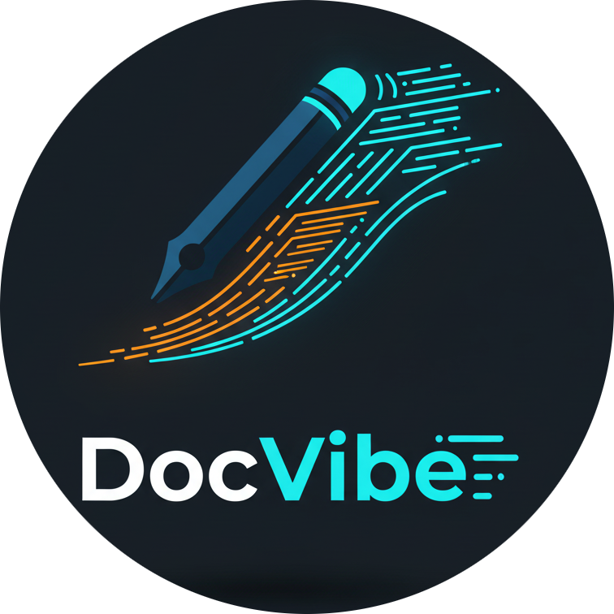
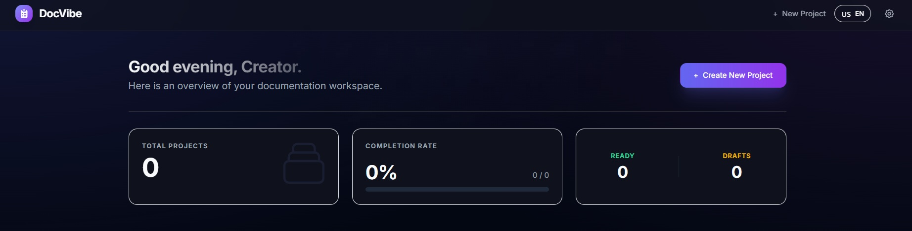

<p align="center">
  
</p>
<p align="center">
  
  
  
  
  
</p>
<h1 align="center">DocVibe - AI-powered documentation for Vibe Coders</h1>



DocVibe is the essential companion for modern developers who move fast. It transforms your raw ideas into comprehensive, professional project documentation in minutes, ensuring your "vibe coding" sessions are grounded in solid architectural decisions.

## Why DocVibe?

In the era of AI-assisted coding, we often skip the boring parts—requirements, schema design, and edge cases—to jump straight into the code. This leads to **blindspots**: unscalable databases, forgotten user flows, or inconsistent tech stacks.

DocVibe bridges the gap between intuition and engineering rigor.

### Key Features

*   **Intelligent Questionnaire**: The AI asks the hard questions you didn't think of, uncovering potential pitfalls before you write a single line of code.
*   **Blindspot Coverage**: Ensures your project has a solid foundation regarding security, scalability, and structure.
*   **Instant Docs**: Generates PRDs, Tech Stacks, Database Schemas, and User Flows automatically.
*   **AI Model Selection**: Choose between the powerful **Gemini 3.0 Pro** for deep reasoning or **Gemini 2.5 Flash** for speed and efficiency.
*   **Export & Restore**: Keep your project specs portable with JSON import/export.

## How it Works

1.  **Describe**: Tell DocVibe what you want to build.
2.  **Clarify**: Answer 10 smart, context-aware technical questions (or let AI help you answer them).
3.  **Generate**: Receive a full suite of markdown documentation ready for your repository.

## Getting Started

### Prerequisites

*   **Node.js**: Ensure you have Node.js installed (v18+ recommended).
*   **Gemini API Key**: You need a valid API key from [Google AI Studio](https://aistudio.google.com/).

### Installation

1.  Clone the repository.
2.  Install the dependencies:
    ```bash
    npm install
    ```

### Configuration

Create a `.env` file in the root directory of the project and add your API key. This key is required for the AI features to function.

```env
GEMINI_API_KEY=your_google_gemini_api_key
```

### Running the App

Start the local development server:

```bash
npm start
```

The application will launch in your default browser (usually at `http://localhost:3000` or `http://localhost:5173` depending on your bundler).

## Tech Stack

*   **Frontend**: React 19, TypeScript
*   **Styling**: Tailwind CSS (with Glassmorphism & Midnight Theme)
*   **AI**: Google Gemini API (`@google/genai` SDK)
*   **Markdown Rendering**: `react-markdown`

## For the Vibe Coder

Stop pausing your flow to write docs. Let DocVibe handle the structure while you handle the magic.